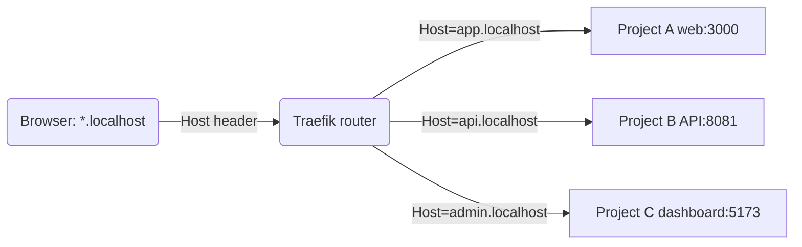
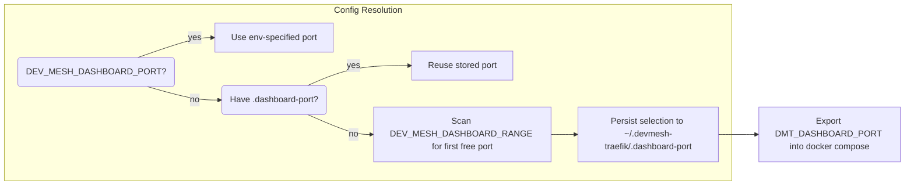
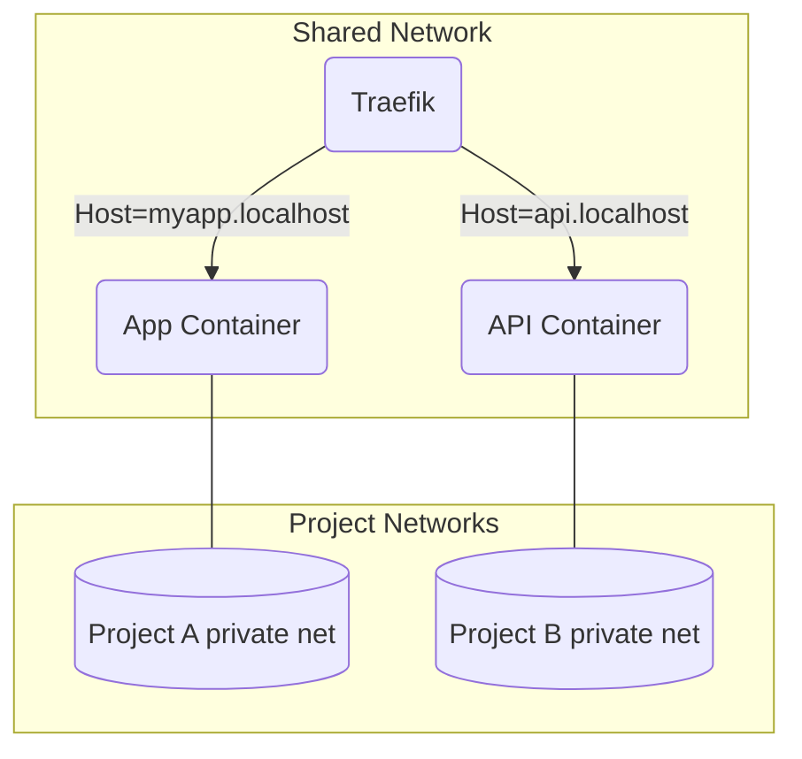
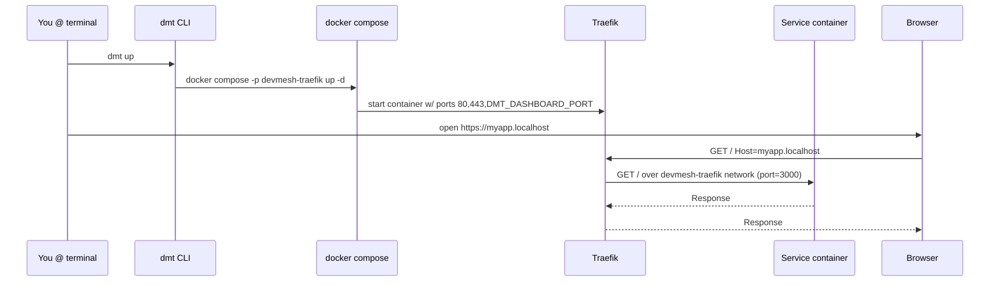

# Devmesh Traefik Runtime

One workstation-wide Traefik router so you can boot every project at once without juggling ports or duplicate proxies. Drop the CLI on your `$PATH`, bind Traefik to 80/443 plus a dynamic dashboard port, and let each project describe its host rules with labels.

## Big picture

- Traefik is installed once into `~/.devmesh-traefik` (override with `DEV_MESH_HOME`).
- Every project that wants routing joins the `devmesh-traefik` docker network (override with `DEV_MESH_NETWORK`).
- Host rules such as `api.repo.localhost` fan traffic to the correct service while the projects keep their own internal networks untouched.



Mermaid diagrams validated via `@mermaid-js/mermaid-cli` so you can paste them straight into docs.

## Install the shared router

```bash
# from this repo
bin/dmt install    # copies the template, creates the shared docker network
bin/dmt up         # starts (or reloads) Traefik

# or use the long name if you prefer
bin/devmesh-traefik up
```

What happens:

1. The template in `traefik/` is copied into `~/.devmesh-traefik` (`DEV_MESH_HOME` lets you point elsewhere).
2. The external docker network `devmesh-traefik` is created once and left alone unless you delete it.
3. A dashboard port is chosen automatically from the `[7680, 7799]` range (override with `DEV_MESH_DASHBOARD_RANGE` or pin one via `DEV_MESH_DASHBOARD_PORT`). The choice is persisted to `~/.devmesh-traefik/.dashboard-port`.
4. Traefik starts in detached mode, binding ports `80`, `443`, and the chosen dashboard port (internal port 8080 stays inside the container).

The dashboard URL is echoed after every `dmt up`. Use `dmt inspect` anytime to see where everything lives.

## CLI cheat sheet

| Command | Alias | Purpose |
|---------|-------|---------|
| `dmt install` | `devmesh-traefik install` | Seed the state directory and shared network. |
| `dmt up` | `devmesh-traefik up` | Start or hot-reload the Traefik stack. |
| `dmt down` | `devmesh-traefik down` | Stop the global router. |
| `dmt restart` | `devmesh-traefik restart` | `down` + `up` back-to-back. |
| `dmt reload` | `devmesh-traefik reload` | Send `HUP` to Traefik to reload dynamic config without container restarts. |
| `dmt status` | `devmesh-traefik status` | Show `docker compose ps` for the global stack. |
| `dmt logs` | `devmesh-traefik logs` | Follow Traefik logs (Ctrl+C to exit). |
| `dmt inspect` | `devmesh-traefik inspect` | Print state dir, compose path, network name, dashboard port, and port range hints. |
| `dmt network` | `devmesh-traefik network` | Ensure the shared network exists; prints its name for scripts. |

Because `bin/dmt` is just a wrapper around `bin/devmesh-traefik`, symlink whichever name you like into a personal bin directory (`ln -s "$PWD/bin/dmt" ~/bin/dmt`).

## Dashboard + port management

- Default dashboard port range: `7680-7799`. The first free port is recorded in `~/.devmesh-traefik/.dashboard-port` so restarts reuse it even if Traefik is running.
- Override the selection completely with:

  ```bash
  DEV_MESH_DASHBOARD_PORT=9090 dmt up
  ```

  This does **not** persist, so remove the env var to fall back to the stored port.

- Change the search range with `DEV_MESH_DASHBOARD_RANGE=8800-8899 dmt up`. The CLI validates the range syntax and errors early if the range is full.
- Need the dashboard URL programmatically? Call `dmt inspect` and parse the `Dashboard :` line.



## Connect a project to the mesh

1. Add `devmesh-traefik` as an external network to the services you want exposed.
2. Add Traefik labels describing hostnames, entrypoints (`web` or `websecure` by default), and the internal port Traefik should hit.
3. Keep your project’s private networks intact; only services that need ingress hop onto the shared one.

```yaml
services:
  web:
    build: .
    ports:
      - "3000" # optional, Traefik can hit the container port directly
    networks:
      - default
      - devmesh-traefik
    labels:
      - traefik.enable=true
      - traefik.http.routers.myapp.rule=Host(`myapp.localhost`)
      - traefik.http.routers.myapp.entrypoints=web
      - traefik.http.services.myapp.loadbalancer.server.port=3000
      - traefik.docker.network=devmesh-traefik

networks:
  devmesh-traefik:
    external: true
```

Want HTTPS? Add `traefik.http.routers.myapp.entrypoints=websecure` + middleware/cert definitions in `~/.devmesh-traefik/config/dynamic/`.



## Request flow (end-to-end)



## Do they all need the same network?

Yes—Traefik can only reach containers that also live on the `devmesh-traefik` network. That does **not** force projects to mingle internally; project-specific databases, caches, and message brokers stay isolated on their default networks. Only the edge-facing services (e.g., `web`, `api`, `storybook`) hop onto the shared network so Traefik can dial them.

If a service runs directly on macOS/Linux instead of docker, lean on a tiny sidecar container that forwards TCP to `host.docker.internal:<port>` and label that sidecar instead. Traefik just needs something on the network boundary to target.

## Power tips

- Drop mkcert-generated certs into `~/.devmesh-traefik/letsencrypt/` and reference them from files in `config/dynamic/` for HTTPS everywhere.
- Fedora/Ubuntu folks: set `DEV_MESH_HOME` somewhere under your Linux home folder if your macOS home is synced via dotfile manager.
- `dmt reload` is instant—great for editing `middlewares.yml` or other dynamic snippets without restarting the container.
- Want project automation? Add `dmt network | awk '{print $NF}'` to scripts that expect the network name.
- Because the CLI is just bash, feel free to vendor it into other repos or wrap it with a Homebrew formula when you’re ready.

## Optional: Lando teams

Traefik does not need to replace Lando’s router—just put Traefik in front of it so every hostname lives under the same `*.localhost` convention:

1. Run `lando info` (or check `.lndo.site`) to see which host/port Lando exposes for a project. Example: `http://myapp.lndo.site:32789`.
2. Create a dynamic config file under `~/.devmesh-traefik/config/dynamic/` that tells Traefik to proxy to that host via `host.docker.internal`.

```yaml
# ~/.devmesh-traefik/config/dynamic/lando-myapp.yml
http:
  routers:
    lando-myapp:
      rule: Host(`myapp.localhost`)
      entryPoints:
        - web
      service: lando-myapp
  services:
    lando-myapp:
      loadBalancer:
        servers:
          - url: http://host.docker.internal:32789   # <-- match the Lando port
```

3. Run `dmt reload` and Traefik will hot-load the file. Nothing changes inside Lando, so you keep its tooling (pull db, `lando ssh`, etc.) while taking advantage of the single shared router + hostname scheme.

TLS? Point the `servers` URL at `https://host.docker.internal:<port>` and set `tls: true` on the router or use whatever cert conventions you already follow—Traefik doesn’t care, it simply forwards traffic to the host-side port that Lando publishes.

## Uninstall / reset

```bash
dmt down
rm -rf ~/.devmesh-traefik   # or $DEV_MESH_HOME
docker network rm devmesh-traefik
```

After that, `dmt install` will recreate everything with fresh config and pick a new dashboard port.
